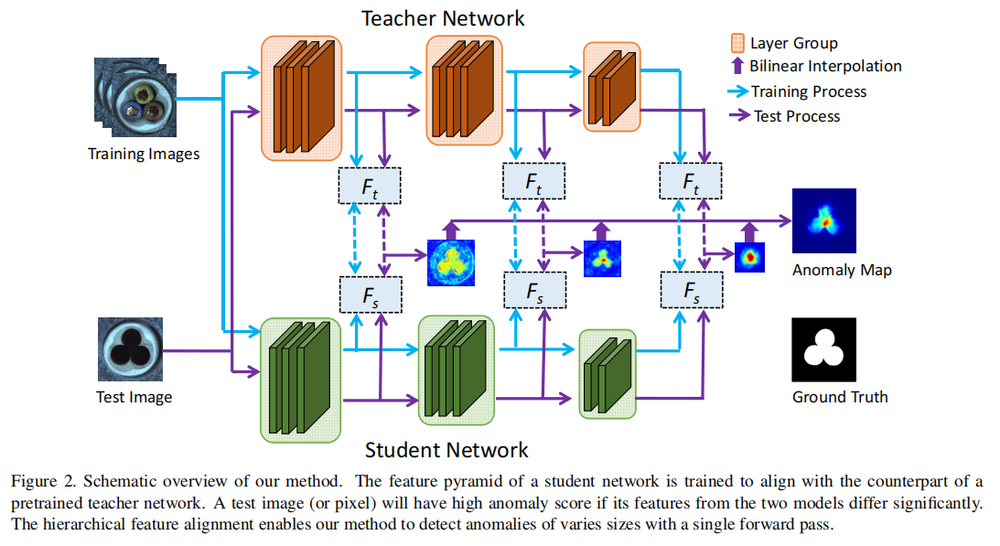
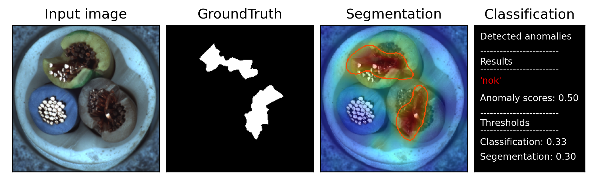
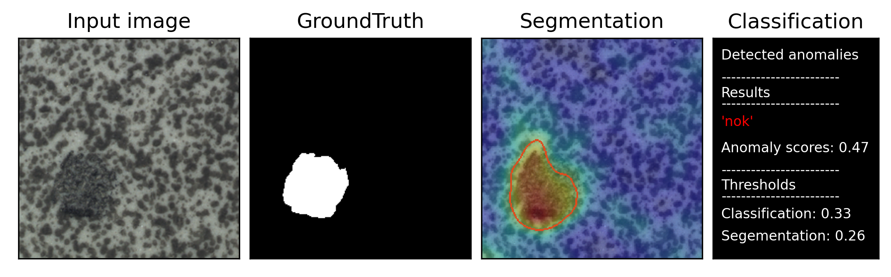
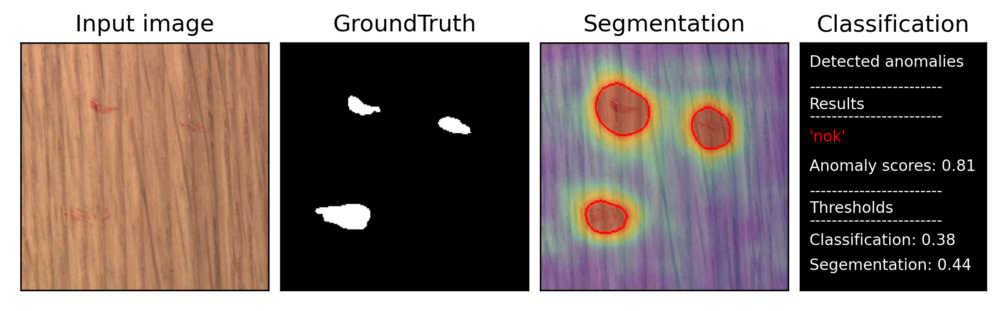
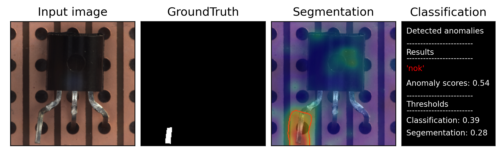
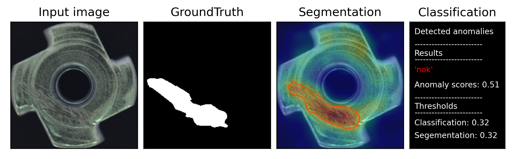

## STPM-Anomaly-Detection-Localization-master
This is an implementation of the paper [Student-Teacher Feature Pyramid Matching for
Unsupervised Anomaly Detection](https://arxiv.org/abs/2103.04257v2). 

### Datasets
MVTec AD datasets : Download from [MVTec website](https://www.mvtec.com/company/research/datasets/mvtec-ad/)

### Environment 
~~~
pip install -r requirements.txt
~~~
### Usage 
~~~
python main.py --phase 'train or test' --dataset_path 'D:/dataset/mvtec_anomaly_detection' --save_path 'path\to\save\results' --obj 'class name'
~~~

### MVTecAD AUC-ROC score (mean of n trials)
| Category | Paper (pixel-level) | This code (pixel-level) | Paper (image-level) | This code (image-level) |
| :-----: | :-: | :-: | :-: | :-: |
| carpet | 0.988 |0.988(1) | - | 0.999(1)|
| grid | 0.990 | 0.980(1)| - |0.925(1) |
| leather | 0.993 | 0.989(1)| - |1.0(1)  |
| tile | 0.974 | 0.919(1)| - |0.979(1) |
| wood | 0.972 |0.926(1) | - |0.988(1) |
| bottle | 0.988 |0.973(1) | - |  0.993(1)|
| cable | 0.955 |0.971(1) | - | 0.995(1) |
| capsule | 0.983 |0.963(1)| - | 0.818(1) |
| hazelnut | 0.985 | 0.971(1)| - | 0.975(1) |
| metal nut | 0.976 |0.963(1) | - |  0.995(1)|
| pill | 0.978 | 0.934(1)| - | 0.887(1) |
| screw | 0.983 | 0.961(1)| - | 0.806(1) |
| toothbrush | 0.989 |0.978(1) | - |  0.989(1)|
| transistor | 0.825 |0.921(1) | - | 0.978(1) |
| zipper | 0.985 | 0.969(1)| - | 0.899(1) |
| mean | 0.970 | 0.960(1) | 0.955 | 0.948(1) |

### Visualization examples

### Acknowledgement

The code is partially adapted from [STPM_anomaly_detection](https://github.com/hcw-00/STPM_anomaly_detection)
